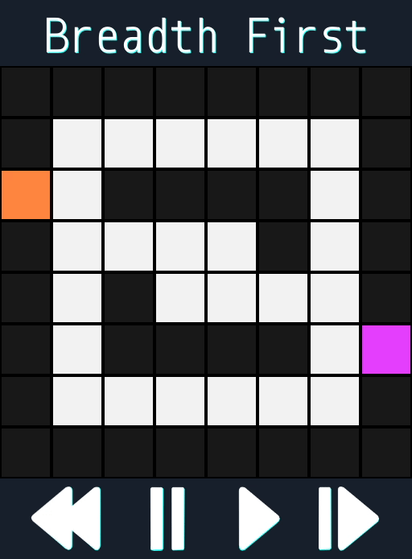
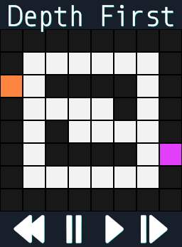

# State Space Search Visualizer
SSSV represents state space search algorithms in an easy to follow maze view.

## Features
-   **Algorithm selector** that shows all algorithms found in `Code/SearchAlgorithms`.

    

-   **Maze editor** which allows the user to change any tile into a path or a wall.

    

-   **Precise controls** let the user step through each step of the algorithm.

    

## Algorithms
Currently SSSV ships with six different algorithms:
-   **Breadth First**
-   **Depth First**
-   **Branch and Bound**
-   **Best First**
-   **Hill Climbing**
-   **A\***

Adding custom algorithms is simple. Just place the algorithm in the `Code/SearchAlgorithms` directory.

Developing search algorithms:

Search algorithm structure:
```gdscript
extends "res://Code/BaseSearchAlgorithm.gd"

func _init(newGraph2D).(newGraph2D):
	pass

func expand(CP, path):
	pass
```

The `expand` method is the most important. It must modify CP so that it contains the paths that should be taken in next steps.

`CP` contains the next posible paths.

`path` contains the path being visited.

The Graph2DSearch class will use the algorithm defined:
1.  It initializes `CP` to contain a path containing only the start node.
2.  While `CP` isn't empty:
    1.  The first path of `CP` is extracted as `C`.
    2.  If `C` reaches the end node, a solution has been found.
    3.  If not, the algorithm's `expand` method is called with `CP` and `C` as parameters.
3.  If `CP` is empty, there are no solutions to the problem.